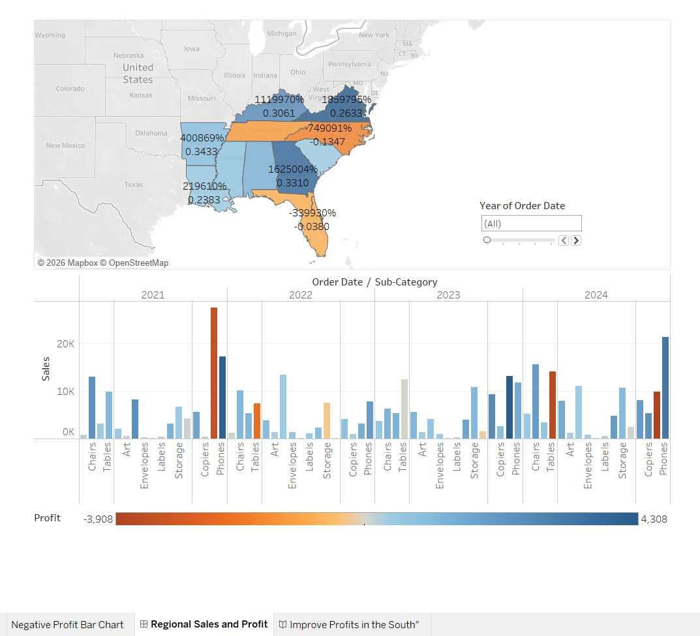

# 🗺️ Regional Sales & Profit Tableau Story

Multi-year Tableau analysis identifying underperforming regions, product categories, and profit drivers across the United States.

## 📊 Dashboard Preview

## 🎯 Project Overview

This Tableau story analyzes sales and profit data to help business leaders:
- Identify regions with negative profit
- Spot underperforming product categories
- Track multi-year performance trends
- Make data-driven expansion decisions

## 🗺️ Profit Map Analysis

The interactive profit map shows:
- **Profit Ratio range:** -17.42% to 34.33%
- **Best performing states:** Georgia, Virginia, Tennessee
- **Worst performing states:** North Carolina, Tennessee
- **Geographic insights** by state and sub-category

## 📈 Sales by Product/Region

Multi-dimensional analysis across:
- **4 Regions:** Central, East, South, West
- **3 Categories:** Furniture, Office Supplies, Technology
- **17 Sub-Categories:** Chairs, Tables, Phones, etc.
- **4 Years:** 2021-2024

## 🚨 Negative Profit Analysis

Problem identification revealed:
- **Burlington (NC):** -$3,840 loss on Machines
- **Jacksonville (FL):** Major losses on Machines & Tables
- **Memphis (TN):** Losses on Binders
- Action needed: Pricing review and category strategy

## 🛠️ Tools & Technologies

- **Tableau Desktop** — Dashboard development
- **Data Storytelling** — Multi-page narrative
- **Geographic Mapping** — Choropleth visualization
- **Interactive Filters** — Year & Sub-Category

## 💡 Key Insights

1. **Machines category** showing consistent losses across multiple states
2. **Tables sub-category** underperforming in 3 cities
3. Strong performance in Office Supplies and Technology
4. Regional differences require targeted strategies

## 👩‍💻 Author

**Pratima Kandel**  
🎓 Business Analytics Graduate Student | Webster University  
📍 St. Louis, MO

---

⭐ *If you found this project helpful, please give it a star!*
