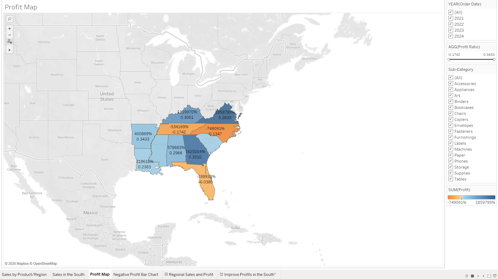
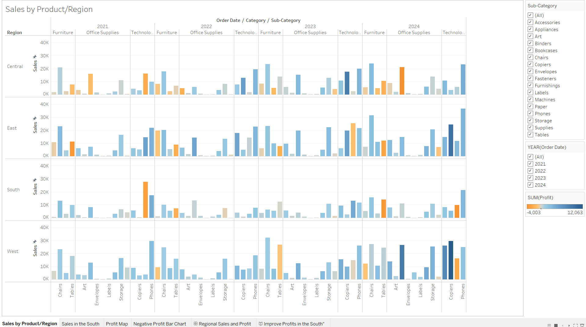
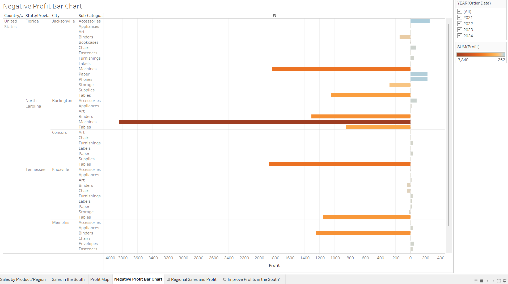

# Regional Sales & Profit Tableau Story

A multi-year Tableau analysis identifying which U.S. regions and product lines are actually profitable and which ones are quietly losing money.

---

## Dashboard Preview

---

## What the Map Shows

Profit ratio across states ranges from -17.42% to 34.33% a wide enough spread that "regional sales" alone tells you almost nothing about where the business is actually making money.

- Best-performing states: Georgia, Virginia, Tennessee
- Worst-performing states: North Carolina, Tennessee

Tennessee shows up on both ends, which was the most interesting part of this analysis high sales volume doesn't guarantee high profit, and this dashboard is built specifically to separate the two.

---

## Product & Region Breakdown

A second view breaks sales down by product sub-category and region across multiple years, making it possible to spot categories that sell well in one region but consistently underperform in another.

---

## Where Profit Turns Negative

A dedicated view isolates the states and categories operating at a loss, so declining performance doesn't get buried inside an overall positive number.

---

## What This Is Useful For

- Flagging regions with negative profit before committing more marketing spend there
- Identifying underperforming product categories by geography
- Supporting expansion or pull-back decisions with multi-year trend data, not a single snapshot

---

## Tools & Technologies

Tableau, multi-year sales and profit datasets

---

## Author

**Pratima Kandel**
MS in Business Analytics, Webster University
St. Louis, MO
Open to Business Analyst & Data Analyst roles

---

If you found this project helpful, feel free to star the repo.
